# Tabla de contenidos
- [Teoria](#Teoria).
    - [Git](#Git).
    - [Git Flow](#Metodología-Git-Flow).
    - [Utilización](#Utilización).
- [Prerrequisitos](#Prerrequisitos).
- [Start](#Start).
    - [Creacion de ramas iniciales](#Creacion-de-ramas-iniciales).
    - [Estructura inicial](#Estructura-inicial).
    - [Contenidos HTML](#Implementación-de-contenidos-HTML).
    - [Atributos HTML](#Implementación-de-atributos-HTML).
    - [Estilos CSS](#Implementación-de-estilos-CSS).
    - [ Mejora sección del usuario 2](#Mejora-de-la-sección-del-usuario-2).
    - [Merge Main Develop](#Mergear-develop-con-main).

# Teoria
Antes de comenzar deeriamos entender los siguientes conceptos:

## Git

- Git es un sistema de control de versiones, el cual nos puede servir para trabajar en equipo de una manera mucho más simple,cómoda y óptima cuando estamos desarrollando una aplicación o software.
- Además de que vamos a poder controlar todos los cambios que se hacen en nuestra aplicación y en nuestro código teniendo acceso al control absoluto de todo lo que pasa en el código, pudiendo volver atrás en el tiempo, pudiendo abrir diferentes ramas de desarrollo, etc.
- De forma que si tenemos dos o tres personas trabajando en ciertas funcionalidades del proyecto,nosotros podemos estar trabajando en nuestra parte del código.

## Metodología Git Flow
- Es un flujo de trabajo aplicado a un repositorio Git. Vincent Driessen fue el encargado de popularizarlo, definiendo un modelo estricto de ramificación diseñado en torno a los lanzamientos del proyecto. Es ideal para proyectos que lleven una planificación de entregas iterativas. 
- Permite la paralelización del desarrollo mediante ramas independientes para la preparación, mantenimiento y publicación de versiones del proyecto, además de que soporta la reparación de errores en cualquier momento.

## Utilización
- En este proyecto, utilizamos la herramienta git flow, ya que podemos desarrollar el proyecto en paralelo. Así, todos los integrantes del proyecto pueden implementar sus features sin preocupación de dañar el codigo de sus compañeros, o de que el suyo propio sea dañado.

# Prerrequisitos
Antes que nada deberemos crear un repositorio en GitHub, al cual yo he llamado Git_Flow.

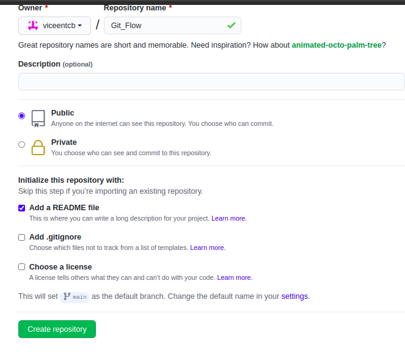

Una vez creado el repositorio lo clonaremos con 3 alias, user1, user2 y user3, para simular los distintos usuarios.

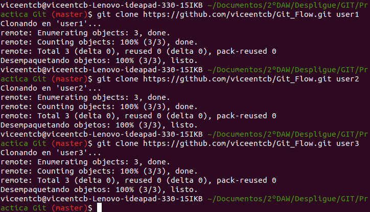
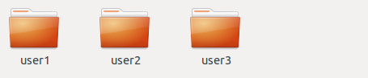

# Start
## Creacion de ramas iniciales
Primero el user1 creará las primeras ramas para el proyecto.
- develop
- feature/estrucura_inicial_user1

Con git branch creamos una rama, y con git checkout nos posicionamos en la rama indicada, pero si le añadimos -b, nos creara la rama si esta no esta creada. 

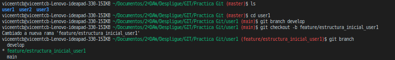


## Estructura inicial
Una vez creadas las ramas el user1 creará un index.html (en su rama feature/estrucura_inicial_user1), en el cual habrá un header con una imagen, un footer, y una barra de navegación en la que de momento solo existira Home

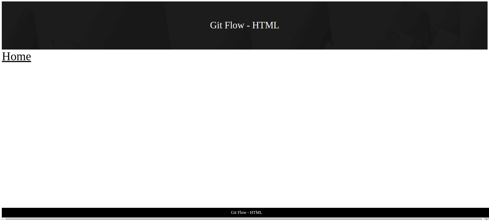

Ahora lo subirá a esta rama, además de a la rama principal.

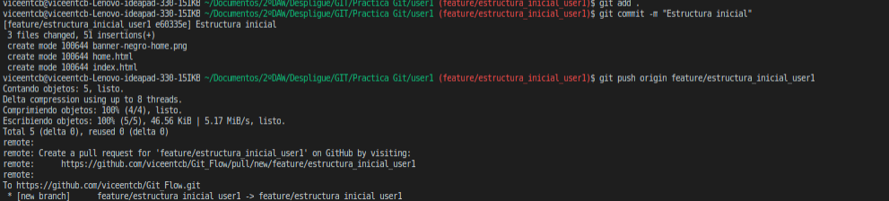

Una vez subido a su rama, se posicionara en develop y realizará un merge (integrar los datos de una rama a otra) de su feature  hacia develop.

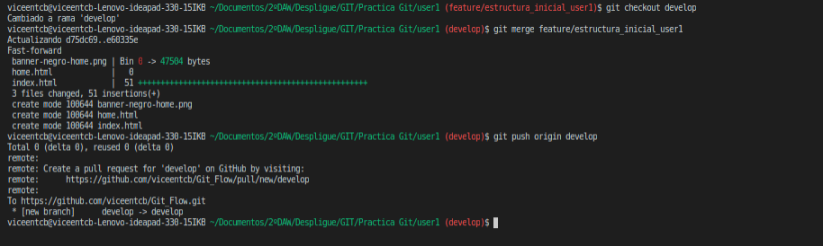

## Implementación de contenidos HTML

Ahora el usuario 2 realizará un pull de main en el cual está la estructura inicial. Ahora se situará en una nueva rama llamada feature/contenidoHTML.

```
cd ../user2
git pull origin main
git checkout - b feature/contenidoHTML
```

Una vez hecho esto creara un nuevo html llamado contenidos y lo añadira en la barr ade navegacion. Luego lo subirá a esta rama.

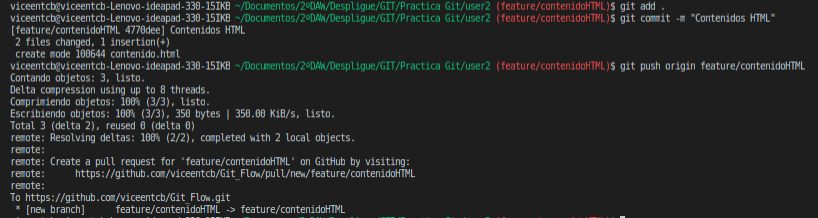

## Implementación de atributos HTML

De nuevo creará una nueva rama llamada feature/atributosHTML.

```
git checkout - b feature/atributosHTML
```

En la cual añadira un nuevo html llamado atributos y lo añadira en la barra de navegación. Una vez mas lo subira a esta misma rama.

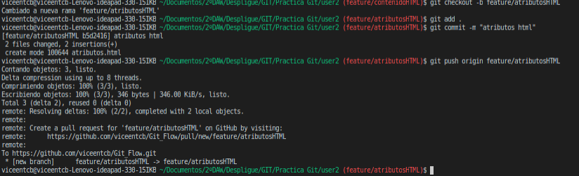

Ahora el usuario 2 mergeara sus dos ramas con las de develop.

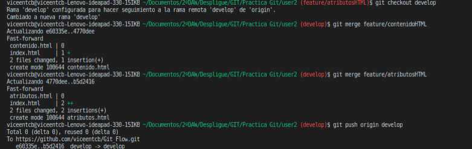

## Implementación de estilos CSS

Ahora el usuario 3 realizará un pull de main en el cual está la estructura inicial. Ahora se situará en una nueva rama llamada feature/estilosCSS.

```
cd ../user3
git pull origin main
git checkout - b feature/estilosCSS
```

Una vez hecho esto añadiremos, en esta rama, un nuevo html llamado estilos y lo añadiremos en la barra de navegación. Posteriormente lo subiremos a esta rama.

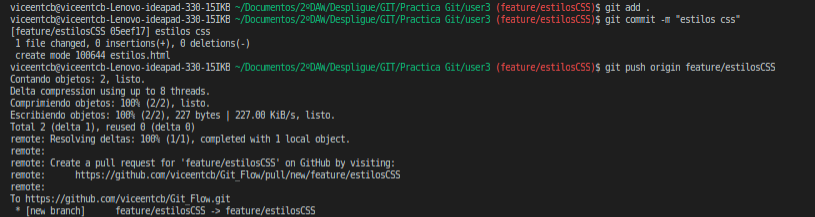

Una vez mas nos situaremos en develop y mergearemos esta rama.

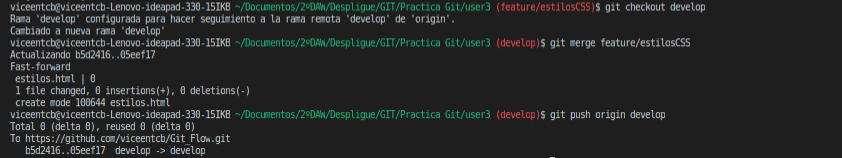

## Implementación de la release

Ahora, este mismo usuario creará una nueva rama, en la que esten todas las demas ramas, con la etiqueta => v1.0.

Primero creamos esta rama con los valores de develop, en la cual estan todas las ramas y le añadimos el tag.

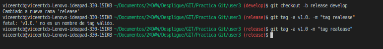

Seguidamente subiremos la rama.

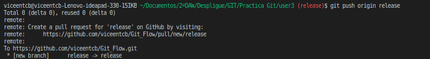

Posteriormente subiremos la etiqueta.

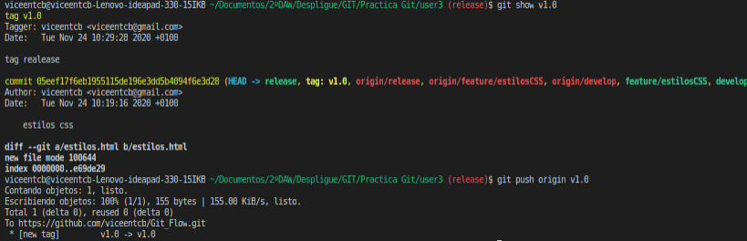

## Mejora de la sección del usuario 2

Una vez terminado todo esto, el user1 realizará un cambio en la seccion del user2. Para esto nos posicionaremos en el user1 y nos situaremos en una nueva rama llamada hotfix/mejorasV_1_0.

```
cd ../user1
```


Posteriormente hará un pull sobre alguna de las ramas del user2, como por ejemplo feature/atributosHTML, para eso haremos un pull de esta rama.

```
git pull origin feature/atributosHTML
```
Ahora realizaremos un cambio, por ejemplo en contenido html, luego lo subiremos a la rama hotfix y realizaremos un merge a la develop.

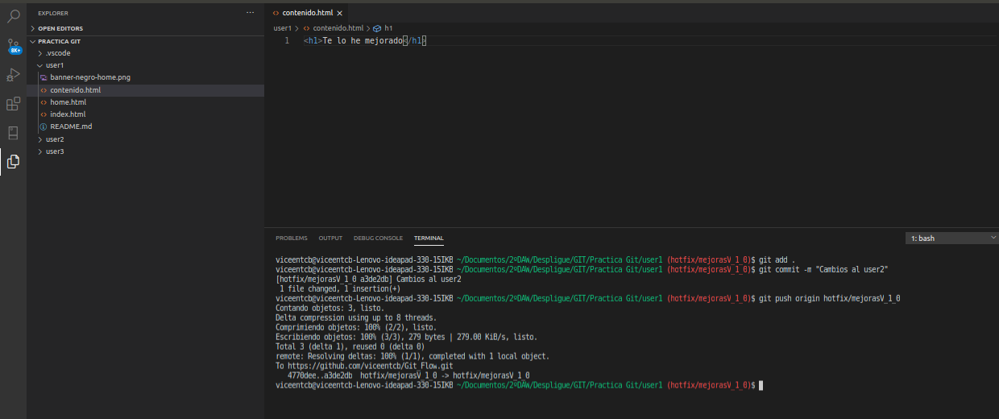

Los cual nos casurá algun problema por eso debemos hacer un pull y luego de nuevo un push.

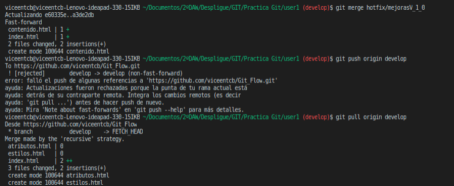
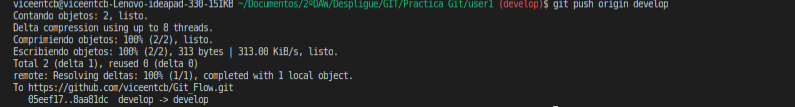

## Mergear develop con main

Para terminar, el usuario1 debe mergear la rama develop con la main.

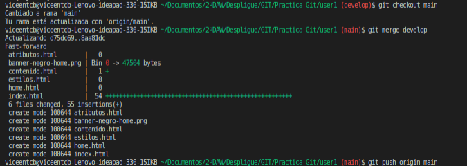


